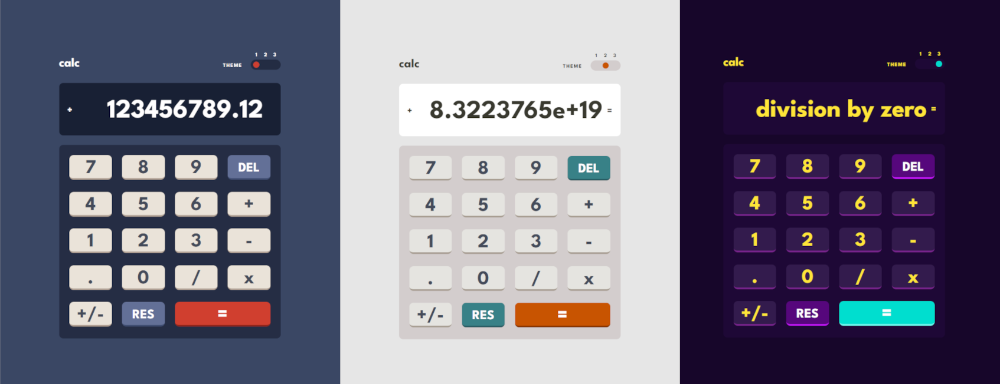
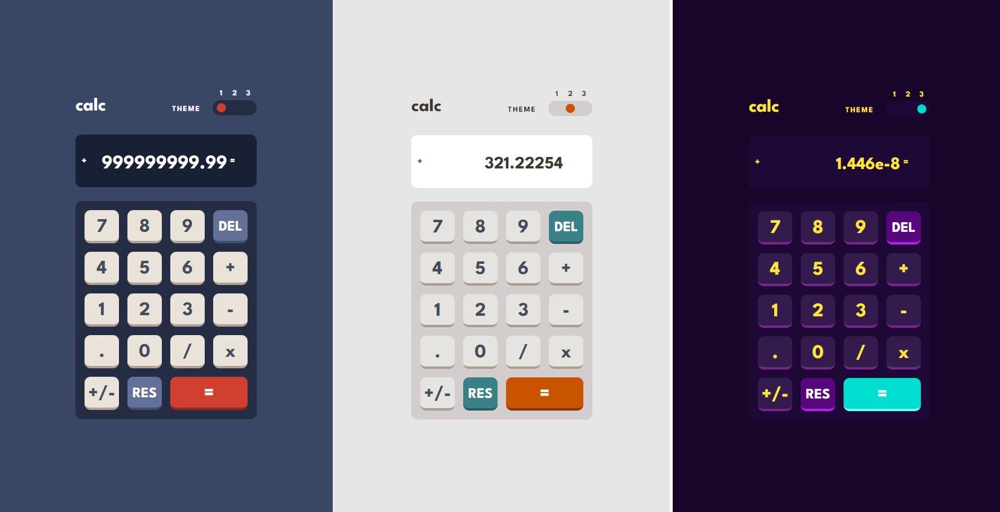

    <h1>Calculator with three themes</h1>
    <h3>
        <a href="https://chriskodehub.github.io/KH-15_calculator/">
            Live demo
        </a>
         | 
        <a href="https://github.com/chriskodehub/KH-15_calculator">
            GitHub
        </a>
    </h3>
    
A simple calculator with potential

         
        
Technologies and tools:

    

        
        
        
        
        
        
        
    

 

## About project

A simple calculator with four math functions. The calculator has three color themes and enables multiple operations until the equals key is pressed.

Algorithms and assumptions that have been implemented:
1. Actions: addition, subtraction, multiplication and division
2. Performing operations on positive and negative numbers
3. Divide by zero error
4. The maximum number of entered characters, numbers, period, and minus sign is 13
5. Results of more than 13 characters are converted to exponent notation
6. The calculator received an additional button to change the +/- sign

### Desktop

### Mobile

## About me

Hello. My name is Krzysztof. I am looking for a job on an interesting and developing project. I am a person who **likes challenges**. I have just started my adventure in the programming industry. I study intensively and experiment with **my projects**. I invite you to [my portfolio](https://chriskodehub.github.io/portfolio/). 

